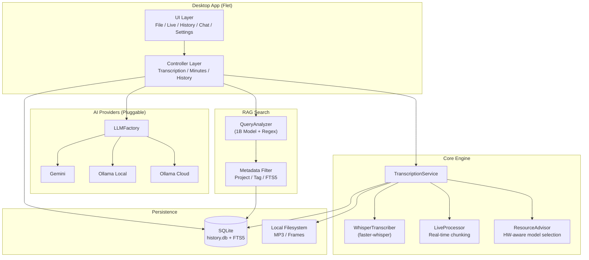

<p align="center">
  
</p>

<h1 align="center">Ayato Transcriber</h1>

<p align="center">
  <strong>Privacy-First, Local AI Transcription & Knowledge Engine</strong>
</p>

<p align="center">
  
  
  
  
  
</p>

---

### 🛡️ 「1バイトも送信しない。100%ローカル実行可能なRAG（検索）エンジン」

> **「企業のセキュリティポリシーを一切変更せずに、明日から導入できるAI議事録」**
> **「1バイトも送信しない。100%ローカル実行可能なRAG（検索）エンジン」**
> **「クラウドAIの『見えないコスト』と『プライバシーリスク』からの解放」**

---

## 🧭 Design Philosophy: Strategic Data Sovereignty
### 「守るべき資産」と「共有すべき知」の戦略的使い分け

現代のAI時代において、データの管理はこれまで以上に重要です。データの性質に応じて、インフラを使い分けることが真のガバナンスだと私たちは考えます。

- **Cloud AI (Active Option):** 機密性は低いが特定のドメイン知識が必要なデータ。これらはクラウドLLMに渡すことで、ビッグテックのモデル学習・最適化の恩恵を最大限に享受し、より高度な推論結果を得る戦略が有効です。
- **Local AI (Default Protection):** 独自のビジネスプロセス、未公開の知的財産、そして究極のプライバシーに関わるデータ。これらは **1バイトも外に出すべきではありません。**

Ayato Transcriber は、この「戦略的使い分け」をユーザー自身がコントロールできる、自由で安全なデータ活用の基盤を提供します。

---

**クラウドに一切のデータを送信しないことが可能な設計**により、モード選択によって設定をすることで、弁護士・研究者・技術者など、機密性の高い情報を扱うプロフェッショナルが安心して利用できます。

---

## Design Philosophy

| 原則 | 説明 |
|------|------|
| **Privacy by Architecture** | 音声データ、文字起こし結果、AIの推論結果がネットワークを通過しません。Whisper と Ollama をローカルで実行します。 |
| **Hardware-Aware Optimization** | システムの RAM / VRAM を自動検出し、最適な AI モデルを推奨します。ハイエンドGPUがなくても動作します。 |
| **Zero Configuration** | `run.bat` をダブルクリックするだけで、Python・依存関係・AIモデルがすべて自動構築されます。 |

---

## Architecture



---

## Key Features

### 1. Multi-Source Transcription
- **ファイル文字起こし**: MP4, MP3, WAV 等の動画・音声ファイルから高精度なテキストを抽出。
- **ライブ文字起こし**: システム音声（オンライン会議等）やマイク入力をリアルタイムでキャプチャ。
- **ビジュアル解析**: 画面キャプチャによるスライド変化の検知。音声だけでは失われる「視覚的文脈」を保存。

### 2. AI-Powered Meeting Intelligence
- **自動議事録生成**: 概要、決定事項、ネクストアクションを構造化して出力。
- **マルチプロバイダー**: Gemini / Ollama Local / Ollama Cloud をワンクリックで切り替え。
- **AIチャット**: 過去の全会議データに対して自然言語で質問可能。RAG (Retrieval-Augmented Generation) による文脈検索。

### 3. Hardware-Aware Intelligence
PC のスペックに応じて、最適な AI モデルを自動選択します。

| Tier | RAM | VRAM | Whisper Model | LLM Model |
|------|-----|------|---------------|-----------|
| Entry | 8GB+ | - | `base` | `llama3.2:1b-instruct-q4_K_M` |
| SmallGPU | 8GB+ | 4GB+ | `small` | `phi3.5:3.8b-mini-instruct-q4_K_M` |
| Standard | 16GB+ | 8GB+ | `medium` | `llama3.1:8b-instruct-q4_K_M` |
| Pro | 32GB+ | 10GB+ | `large-v3` | `gemma2:9b-instruct-q4_K_M` |
| Monster | 64GB+ | 22GB+ | `large-v3` | `llama3.3:70b-instruct-q4_K_M` |

---

## Tech Stack

| Category | Technology | Why |
|----------|-----------|-----|
| **Speech-to-Text** | [faster-whisper](https://github.com/SYSTRAN/faster-whisper) | OpenAI Whisper の CTranslate2 最適化版。CPU/GPU 両対応で高速。 |
| **LLM Integration** | [Ollama](https://ollama.com/) / [Gemini](https://ai.google.dev/) | ローカルLLMとクラウドLLMを同一インターフェースで切り替え可能。 |
| **Desktop UI** | [Flet](https://flet.dev/) | Flutter ベースの Python UI フレームワーク。クロスプラットフォーム対応。 |
| **Audio Capture** | [PyAudioWPatch](https://github.com/s0d3s/PyAudioWPatch) | Windows WASAPI loopback によるシステム音のキャプチャ。 |
| **RAG Search** | QueryAnalyzer + SQLite FTS5 | **[現行]** 1B LLM による意図解析 + メタデータフィルタ。低スペック環境で高精度・低レイテンシを実現。 |
| **Embeddings** | [FastEmbed](https://github.com/qdrant/fastembed) | **[アーカイブ済]** ベクトル検索インフラ。現行のメタデータ検索で代替。将来的な再統合のため `アーカイブ/Embedding/` に保存。 |
| **Package Manager** | [uv](https://github.com/astral-sh/uv) | Rust 製の超高速 Python パッケージマネージャ。 |
| **Linter** | [Ruff](https://github.com/astral-sh/ruff) | Rust 製の超高速 Python リンター & フォーマッター。 |
| **CI/CD** | GitHub Actions | 自動テスト、自動リリース、デスクトップバイナリの自動ビルド。 |

---

## Quality Assurance

本プロジェクトでは、3 層のテスト戦略によりソフトウェア品質を担保しています。

```
tests/
  unit/          ... 関数・メソッド単位の独立テスト (モック使用)
  integration/   ... Whisper モデルの実ロードを含む連携テスト
  e2e/           ... ファイル選択 -> 文字起こし -> DB保存 -> AI要約 の全フロー検証
```

- **静的解析**: `ruff` による自動リント & フォーマット (CI で強制)
- **自動リリース**: `python-semantic-release` によるセマンティック・バージョニング
- **クロスプラットフォーム・ビルド**: GitHub Actions で Windows / macOS のデスクトップバイナリを自動生成

---

## Getting Started

### Option 1: Desktop App (推奨)

Python のインストール不要。[Releases](https://github.com/Ayato-AI-for-Auto/Transform_MovieToText/releases) から最新バイナリをダウンロードしてください。

### Option 2: Thin Client (Windows)

`run.bat` をダブルクリックするだけで、Python / PyTorch / 全依存関係が自動インストールされます。

```
TransformMovieToText-Windows-ThinClient.zip をダウンロード -> 展開 -> run.bat を実行
```

### Option 3: From Source

```bash
git clone https://github.com/Ayato-AI-for-Auto/Transform_MovieToText.git
cd Transform_MovieToText

# ローカルインストール
uv pip install -e .

# GPU を使う場合
uv pip install torch torchvision torchaudio --extra-index-url https://download.pytorch.org/whl/cu121

# 起動
uv run main.py
```

---

## System Requirements

| Item | Requirement |
|------|-------------|
| **OS** | Windows 10 / 11 (Primary), macOS (Experimental) |
| **FFmpeg** | システムにインストール済み、PATH が通っていること |
| **RAM** | 8GB 以上 (16GB+ 推奨) |
| **GPU** | NVIDIA CUDA 対応 GPU があれば高速化。なくても動作可能 |

---

## Project Structure

```
.
├── src/
│   ├── core/           # ビジネスロジック (Whisper, LLM, DB, RAG, Config)
│   ├── controllers/    # UIとCoreの仲介層
│   ├── llm/            # LLMプロバイダー (Factory Pattern)
│   ├── recorder/       # 音声キャプチャ (Strategy Pattern)
│   ├── ui/             # Flet UI コンポーネント
│   └── utils/          # 共通ユーティリティ
├── tests/
│   ├── unit/           # 単体テスト
│   ├── integration/    # 結合テスト
│   └── e2e/            # 総合テスト
├── アーカイブ/
│   └── Embedding/      # ベクトル検索インフラ (将来の再統合に備えて保存)
├── data/               # ランタイムデータ (DB, 履歴, 一時ファイル)
├── .github/workflows/  # CI/CD パイプライン
└── docs/               # 設計ドキュメント
```

---

## Versioning

[Conventional Commits](https://www.conventionalcommits.org/) に準拠し、`python-semantic-release` による自動バージョニングを行っています。

| Prefix | Effect | Example |
|--------|--------|---------|
| `feat:` | Minor version bump | `2.6.0` -> `2.7.0` |
| `fix:` | Patch version bump | `2.6.0` -> `2.6.1` |
| `BREAKING CHANGE:` | Major version bump | `2.x.x` -> `3.0.0` |

---

## 🏢 チーム・組織での導入をご検討の方へ

本システムは、**個人での利用（シングルユーザー）を前提に設計・最適化**されています。
SQLiteを使用したスタンドアロン構成のため、複数人でのデータ共有や、組織内での閲覧権限管理（RBAC）が必要な環境には、そのままでは適さない場合があります。

もし、以下のような「組織レベルでの導入」をご希望の場合は、有償にて個別カスタマイズ・導入支援のご相談を承ります。

- **中央集権型管理**: MySQL / PostgreSQL 等の外部データベースへの移行
- **サーバーサイド運用**: ローカルサーバー / クラウド環境での常時稼働
- **セキュリティの高度化**: ログイン認証、ユーザーごとの閲覧・編集権限の構築
- **既存システム連携**: 社内ポータルや外部ナレッジベースとのAPI連携

**[お問い合わせ先]**
[cwblog69@gmail.com]
（個別要件に応じたお見積もりをさせていただきます）

---

## License

[Apache License 2.0](LICENSE)
