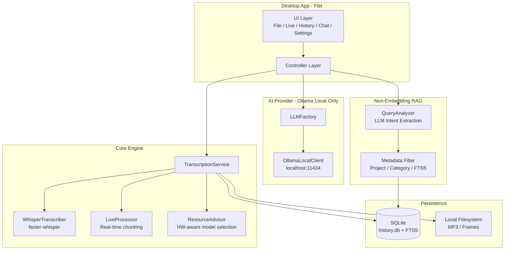

<p align="center">
  
</p>

<h1 align="center">Transform_MovieToText</h1>

<p align="center">
  <strong>100% Local AI Transcription & Knowledge Engine for Windows</strong><br/>
  1バイトも外部に送信しない、完全ローカル完結のAI議事録 & ナレッジ検索
</p>

<p align="center">
  
  
  
  
  
  
  
</p>

---

## 課題

| ビジネス上の課題 | 既存SaaSの限界 | 本アプリの回答 |
| :--- | :--- | :--- |
| 機密会議の内容をAIに渡せない | クラウドに音声データが送信される | **全処理がローカル完結。回線を抜いても動作する** |
| SaaS費用が毎月かさむ | Whisper API + GPT-4 で1時間あたり数百円 | **導入費0円、月額0円、利用制限なし** |
| 過去の会議内容を探し出せない | 手動でファイルを検索する必要がある | **AIチャットに質問するだけで即座にソース付き回答** |

---

## 主な機能

### 文字起こし
- **ファイル文字起こし** -- MP4, MP3, WAV 等から高精度なテキストを抽出
- **リアルタイム文字起こし** -- オンライン会議の音声をリアルタイムでキャプチャ
- **物理カット＋重ね合わせ方式** -- 5秒のオーバーラップで継ぎ目のない長時間処理を実現

### AI議事録
- 文字起こし完了後、ローカルLLMが自動で清書・要約・構造化
- 概要、決定事項、ネクストアクションを一括出力

### ナレッジ検索 (Non-Embedding RAG)
- 過去の全会議データに対して自然言語で質問
- AIの回答には**引用元（会議名・日時）がシステムロジックとして自動付与**
- プロジェクト単位での絞り込みに対応

### ROIダッシュボード
- 処理実績から「節約された作業時間」「回避されたSaaSコスト」をリアルタイム算出
- 導入効果を数値で証明

---

## アーキテクチャ



---

## Non-Embedding RAG: 軽量で高速な検索アーキテクチャ

本アプリは、一般的なRAGシステムで用いられるベクトルデータベースや Embedding モデルを**意図的に採用していません**。

| 観点 | 一般的なRAG (Embedding) | 本アプリ (Non-Embedding) |
| :--- | :--- | :--- |
| **検索方式** | ベクトル類似度検索 | SQLite FTS5 全文検索 + LLM意図解析 |
| **追加モデル** | Embeddingモデルのロードが必要 | 不要（既存LLMを流用） |
| **メモリ消費** | 高い（ベクトルインデックス常駐） | 極めて低い（SQLiteのみ） |
| **精度** | 文脈の「雰囲気」で検索 | キーワード＋メタデータでピンポイント検索 |
| **ローカル適性** | GPU/RAMを大量消費 | 8GB RAMのPCでも快適に動作 |

**処理フロー:**
1. ユーザーの質問をLLMが解析し、「検索キーワード」「対象プロジェクト」「対象カテゴリー」を抽出
2. 抽出されたメタデータでSQLite FTS5を高速検索（ハードウェア負荷はほぼゼロ）
3. 絞り込まれたドキュメントのみをLLMに渡し、ソース付きで回答を生成

---

## ハードウェア自動最適化

PCのスペックを自動検出し、最適なAIモデルを選択します。ハイエンドGPUがなくてもCPUフォールバックで動作します。

| Tier | RAM | VRAM | Whisper Model | LLM Model |
| :--- | :--- | :--- | :--- | :--- |
| Entry | 8GB+ | - | `base` | `llama3.2:1b-instruct-q4_K_M` |
| Small GPU | 8GB+ | 4GB+ | `small` | `phi3.5:3.8b-mini-instruct-q4_K_M` |
| Standard | 16GB+ | 8GB+ | `medium` | `llama3.1:8b-instruct-q4_K_M` |
| Pro | 32GB+ | 10GB+ | `large-v3` | `gemma2:9b-instruct-q4_K_M` |
| Monster | 64GB+ | 22GB+ | `large-v3` | `llama3.3:70b-instruct-q4_K_M` |

---

## テクノロジースタック

| カテゴリ | 技術 | 選定理由 |
| :--- | :--- | :--- |
| **音声認識** | [faster-whisper](https://github.com/SYSTRAN/faster-whisper) | OpenAI Whisper の CTranslate2 最適化版。CPU/GPU 両対応で高速 |
| **推論エンジン** | [Ollama](https://ollama.com/) | ローカルLLMモデル管理のデファクト。外部通信を遮断した推論 |
| **検索基盤** | SQLite FTS5 | 非Embedding型 RAG。メモリ消費を極限まで抑え秒速検索 |
| **UI** | [Flet](https://flet.dev/) | Flutter ベースの Python UI。美しくクロスプラットフォーム |
| **音声キャプチャ** | [PyAudioWPatch](https://github.com/s0d3s/PyAudioWPatch) | Windows WASAPI loopback によるシステム音キャプチャ |
| **パッケージ管理** | [uv](https://github.com/astral-sh/uv) | Rust製の超高速 Python パッケージマネージャ |
| **リンター** | [Ruff](https://github.com/astral-sh/ruff) | Rust製の Python リンター & フォーマッター |
| **CI/CD** | GitHub Actions | 自動テスト、セマンティックリリース、デスクトップバイナリ自動ビルド |

---

## クイックスタート

### Option 1: デスクトップアプリ（推奨）

Pythonのインストール不要です。

1. [Releases](https://github.com/Ayato-AI-for-Auto/Transform_MovieToText/releases) から最新のインストーラーをダウンロード
2. [ollama.com](https://ollama.com/) から Ollama をインストール
3. アプリを起動 -- 以上

### Option 2: Thin Client (Windows)

`run.bat` をダブルクリックするだけで、Python・依存関係・AIモデルがすべて自動構築されます。

### Option 3: ソースから起動

```bash
git clone https://github.com/Ayato-AI-for-Auto/Transform_MovieToText.git
cd Transform_MovieToText

# 依存関係のインストール
uv pip install -e .

# GPU を使う場合（CUDA 12.1）
uv pip install torch torchvision torchaudio --extra-index-url https://download.pytorch.org/whl/cu121

# 起動
uv run main.py
```

---

## システム要件

| 項目 | 要件 |
| :--- | :--- |
| **OS** | Windows 10 / 11（Primary）、macOS（Experimental） |
| **FFmpeg** | システムにインストール済み、PATHが通っていること |
| **RAM** | 8GB 以上（16GB+ 推奨） |
| **GPU** | NVIDIA CUDA 対応 GPU があれば高速化。なくても動作可能 |
| **Ollama** | バックグラウンドで起動していること |

---

## 品質保証

3層のテスト戦略でソフトウェア品質を担保しています。

```
tests/
  unit/          # 関数・メソッド単位の独立テスト
  integration/   # Whisperモデルの実ロードを含む連携テスト
  e2e/           # ファイル選択 -> 文字起こし -> DB保存 -> AI要約 の全フロー検証
```

- **静的解析**: Ruff による自動リント（CI で強制）
- **自動リリース**: python-semantic-release によるセマンティック・バージョニング
- **バイナリビルド**: GitHub Actions で Windows / macOS のデスクトップバイナリを自動生成

---

## バージョニング

[Conventional Commits](https://www.conventionalcommits.org/) に準拠しています。

| Prefix | Effect | Example |
| :--- | :--- | :--- |
| `feat:` | Minor version bump | `2.6.0` -> `2.7.0` |
| `fix:` | Patch version bump | `2.6.0` -> `2.6.1` |
| `BREAKING CHANGE:` | Major version bump | `2.x.x` -> `3.0.0` |

---

## ライセンス

**GNU Affero General Public License v3.0 (AGPL-3.0)**
Copyright (c) 2026 Ayato-AI

「データは個人の資産である」という信念のもと、オープンソースかつプライバシー重視で開発されています。

---

<p align="center">
  <strong>Transform_MovieToText -- あなたの会議を、検索可能な資産に変える。</strong>
</p>
