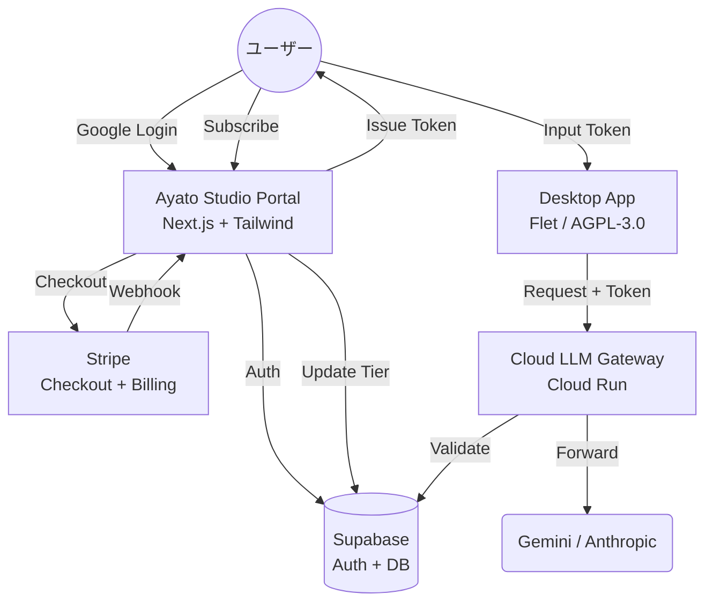

# 汎用認証・決済フレームワーク (Ayato Studio Portal) 構築プラン

このドキュメントは、`ayato_studio_portal` を中心とした、Google 認証、Stripe 決済、およびプロダクト横断的なユーザー権限管理基盤の構築計画です。

---

## 1. 全体アーキテクチャ

---

## 2. データベース設計 (Supabase)

### `profiles` テーブル
ユーザーの基本情報を管理します。
- `id`: uuid (Primary Key, Supabase Auth ID)
- `email`: text
- `full_name`: text
- `avatar_url`: text
- `current_tier`: enum ('free', 'pro', 'enterprise')
- `stripe_customer_id`: text

### `api_tokens` テーブル
デスクトップアプリから Gateway へアクセスするための認証トークン。
- `id`: uuid
- `user_id`: uuid
- `token_hash`: text (SHA-256)
- `name`: text (例: "My Desktop PC")
- `last_used_at`: timestamp

### `subscriptions` テーブル
Stripe の契約状況をミラーリングします。
- `id`: text (Stripe Subscription ID)
- `user_id`: uuid
- `status`: text (active, trialing, canceled)
- `price_id`: text
- `cancel_at_period_end`: boolean

---

## 3. 実装フェーズ

### フェーズ 1: 認証基盤の構築
- [ ] **Supabase Auth 統合**: Google OAuth の有効化と、Login/Signup UI の実装。
- [ ] **ミドルウェア設定**: ログイン済みユーザーのみが「マイページ」にアクセスできるガードを実装。

### フェーズ 2: 決済フローの統合 (Stripe)
- [ ] **Stripe Checkout**: 商品（Proプラン）の作成と、ポータルからの決済ボタン実装。
- [ ] **Webhook API**: Stripe からの `checkout.session.completed` や `customer.subscription.updated` 通知を受け取り、Supabase の `profiles.current_tier` を自動更新するロジックを実装。

### フェーズ 3: トークン管理機能
- [ ] **トークン発行 UI**: ユーザーがデスクトップアプリ用トークン（`ayato-xxxx-xxxx`）を生成・削除できる画面を作成。
- [ ] **使用量ダッシュボード**: API コール回数（後述の Gateway と連携）の可視化。

### フェーズ 4: ゲートウェイ (Cloud Run) との連携
- [ ] **Gateway 用 API 端点**: トークンを受け取って `PRO` かどうかを判定する内部 API を作成。
- [ ] **デスクトップアプリ連携**: デスクトップアプリの「アクティベート」ボタンから、このポータルの認証 API を叩くように修正。

---

## 4. 成功の定義

1.  **「魔法の体験」**: ユーザーが Google ログインし、Stripe で決済後、発行されたキーをデスクトップアプリに入れるだけで、全機能が即座に解放される。
2.  **「運用コストの最小化」**: クレジットカード情報の管理、領収書発行、プラン変更をすべて Stripe に委ねる。
3.  **「拡張性」**: 次の新しい AI プロダクトを作った際、SQL の `profiles` に新しいフラグを追加するだけで、決済・認証基盤をそのまま流用できる。

---

## 5. 検討が必要な事項 (Open Questions)

- **トライアル期間**: 新規ユーザーに 7 日間の Pro トライアルを自動提供するか？
- **同時接続数**: 同一アカウント（同一トークン）での同時利用を何台まで許可するか？
- **プロキシ Gateway のコスト**: ユーザーのサブスク料金内で、LLM API コストをどう管理（制限）するか？

---

## 6. 参考にすべきオープンソース (Standing on the shoulders of giants)

「車輪の再発明」を避けるため、以下の MIT/Apache ライセンスのプロジェクトのアーキテクチャを積極的に「搾取」します。

### [Next.js Subscription Payments](https://github.com/vercel/nextjs-subscription-payments) (MIT)
- **役割**: Stripe Webhook と Supabase 同期の決定版。
- **活用点**: `ayato_studio_portal` の決済・サブスクリプション管理のコアロジック。
- **学べる点**: 堅牢なメタデータ定義と、Stripe Customer Portal への接続。

### [SaaS Starter](https://github.com/mickasmt/next-saas-stripe-starter) (MIT)
- **役割**: 洗練された SaaS UI のリファレンス。
- **活用点**: プラン選択画面（Pricing Card）やログイン後のダッシュボードレイアウト。
- **学べる点**: Tailwind CSS v4 + Shadcn UI によるモダンな UI 構築手法。

### [Taxonomy](https://github.com/shadcn-ui/taxonomy) (MIT)
- **役割**: API トークン発行 UI のベストプラクティス。
- **活用点**: デスクトップアプリ用トークンの生成・管理・表示（一回限りの表示など）の UX 設計。

### [Supabase SaaS Starter](https://github.com/supabase-community/supabase-saas-starter) (Apache-2.0)
- **役割**: Supabase Auth と Prisma/PostgreSQL の連携。
- **活用点**: `profiles` テーブルと、Google OAuth による自動的なプロファイル生成。
